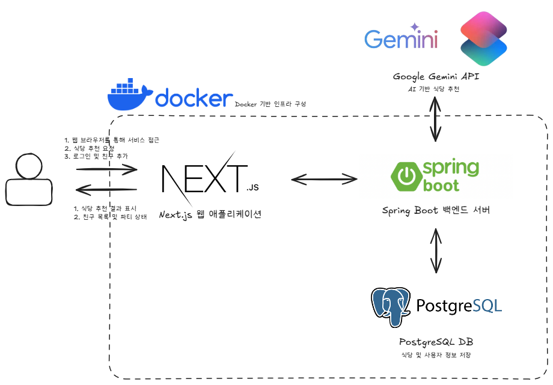

#
<div align="center">

</div>

# <div align="center">이거무라</br>- AI 기반 맞춤형 식당 추천 서비스</div>
### 이동윤재중 소개
| 김해중 | 김동윤 | 권윤재 | 박준이 |
|:-------:|:-------:|:-------:|:-------:|
| |  |  |  |
| hjkim2124@<br/>pusan.ac.kr | dongyoon0201@<br/>naver.com | jae3344@<br/>pusan.ac.kr | zun_e@<br/>kakao.com |
| 프론트앤드 개발 | 백앤드 개발 | AI 추천 시스템 개발 | 프로젝트 총괄 |
#

### 1. 프로젝트 소개
#### 1.1. 개발배경 및 필요성
학교 근처에서 끼니를 해결해야 하는 일이 잦은 학생들은 대부분 익숙한 몇몇 식당만 반복해서 방문하게 됩니다. "오늘 뭐 먹지?"라는 고민을 해소하기 위한 서비스의 필요성을 느꼈고, 여기에 AI API 활용 경험을 접목해 실질적인 서비스를 구현하고자 본 프로젝트를 기획하게 되었습니다.
<br/>

#### 1.2. 개발목표
본 프로젝트의 개발 목표는 학교 근처에서 식사를 해결해야 하는 학생들이 매일 겪는 "오늘 뭐 먹지?"라는 고민을 덜어줄 수 있는 맞춤형 식당 추천 서비스를 제공하는 것입니다. 특히 반복적으로 이용하는 몇몇 식당만 떠올리는 기존의 패턴에서 벗어나, AI 기반 추천 시스템을 통해 다양한 선택지를 제시하고 새로운 식당을 발견할 수 있는 기회를 제공하고자 합니다. 이 과정에서 Google의 Gemini API를 활용하여 실제 서비스에 AI API를 적용해보는 경험을 쌓으려 합니다. 이를 통해 실질적인 기술 역량을 향상시키고, AI 추천 서비스 개발 역량을 키우고자 합니다.
<br/>

#### 1.3. 주요 기능
 1. AI 기반 식당 추천 시스템을 통해 사용자의 취향에 맞는 식당을 추천합니다.
 2. 식당 평가 시스템을 도입해 사용자가 추천받은 식당에 대해 직접 평가하고 피드백을 남기면, 해당 정보를 반영해 추천 정확도를 지속적으로 개선해 나갑니다.
 3. 개인뿐만 아니라 여러 명이 함께 식사할 경우에도 인원과 구성원의 선호를 고려한 집단 추천 시스템을 제공하여, 소모임이나 동아리 활동 등 다양한 상황에서도 유용하게 사용할 수 있도록 설계할 예정입니다
<br/>

#### 1.4. 세부내용
- 개인 및 집단 맞춤형 식당 추천
- 사용자 피드백(별점/한줄평)을 통한 추천 모델 개선
- 위치 기반 UI 및 정보 보안 고려
- 웹 기반 서비스로 개발 (Spring Boot + Next.js + PostgreSQL)
- Gemini API를 통한 AI 응답 처리
<br/>

#### 1.5. 기존 서비스(상품) 대비 차별성
기존 식당 추천 서비스는 인기 식당이나 위치 중심으로 추천합니다. 반면, 이거무라는 사용자의 알러지, 비선호 음식, 최근 방문 이력 등을 기반으로 사용자별로 최적화된 식당을 추천합니다. 즉, 단순 거리 중심이 아닌 **개인화**에 초점을 맞추고 있습니다.
<br/>

#### 1.6. 사회적 가치 도입 계획
- 부산대학교 인근 식당과의 제휴를 통해 **지역 상권 활성화**
- 자취생/기숙사생 등의 **식사 접근성 향상**
- 추천 데이터 기반 **선호도 분석 → 서비스 고도화**
- 향후 타 대학 및 지역으로 **서비스 확장 가능성**
<br/>


### 2.상세설계
#### 2.1. 시스템 구성도
<div align="center">

</div>
<br/>

#### 2.3. 사용기술
- Frontend
  - Next.js, TypeScript, Tailwind CSS :　CSR/SSR 하이브리드 렌더링 기반 UI 구현
  - Zustand : 전역 상태 관리
  - Lottie, Custom Font : 애니메이션 효과 및 사용자 경험 향상
- Backend
  - Java 17, Spring Boot, Gradle : REST API 서버 구현, 의존성 관리
  - Spring Security, JWT : 사용자 인증 및 권한 관리
  - JPA (Hibernate), PostgreSQL : ORM 기반 데이터 저장 및 쿼리 처리
  - Swagger / SpringDoc : API 문서 자동화
- DB
  - PostgreSQL : 관계형 데이터베이스
- AI
  - Google Gemini API : AI 기반 식당 추천 로직 실행
- Infra
  - Docker, Docker Compose : 전체 서비스 컨테이너화 및 실행
  - Nginx (리버스 프록시, 정적파일 제공) : 웹 요청 라우팅 및 보안
- 협업 도구
  - GitHub, Notion, Figma : 형상관리, 문서 협업, UI 설계
<br/>


### 3. 개발결과
#### 3.1. 디렉토리 구조
```
📦 EatThis
├── 📁 EatThisBack          # 백엔드(Spring Boot)
│   ├── Dockerfile
│   ├── build.gradle
│   ├── settings.gradle
│   ├── pom.xml
│   ├── gradlew / gradlew.bat
│   ├── 📁 src
│   │   └── main/java/com/ydyjj/eatthisback
│   │       ├── EatThisBackApplication.java
│   │       ├── 📁 common                # 공통 응답 형식
│   │       ├── 📁 config                # 설정 (보안, Swagger 등)
│   │       ├── 📁 controller            # API 컨트롤러
│   │       ├── 📁 dto                   # 데이터 전송 객체
│   │       ├── 📁 entity                # JPA 엔티티
│   │       ├── 📁 exception             # 전역 예외 처리
│   │       ├── 📁 repository            # DB 리포지토리
│   │       ├── 📁 security              # JWT 및 인증 로직
│   │       └── 📁 service
│   │           └── 📁 impl             # 서비스 구현체
│   └── 📁 resources
│       └── application.properties

├── 📁 EatThisFront         # 프론트엔드(Next.js)
│   ├── Dockerfile
│   ├── package.json / lock
│   ├── next.config.ts / js
│   ├── 📁 app               # 페이지별 라우팅
│   │   ├── login, signup, find, friends, main, visits, result 등
│   ├── 📁 components        # UI 컴포넌트
│   ├── 📁 hooks             # 커스텀 훅
│   ├── 📁 lib               # API 함수, 유틸
│   ├── 📁 public            # 정적 파일 및 이미지
│   ├── 📁 store             # 상태 관리
│   └── tailwind.config.ts  # Tailwind 설정

├── 📁 EatThisInfra         # 인프라 구성(Docker, DB, Nginx)
│   ├── docker-compose.yml
│   ├── 📁 db
│   │   └── init.sql
│   └── 📁 nginx
│       └── nginx.conf
```


**추후 수정하겠습니다.**
<br/><br/><br/><br/>
#### 3.2. 전체시스템 흐름도
- 유저 플로우 차트
  > 코딩 역량강화 플랫폼의 회원가입 부분만 작성했습니다. <br/>
  > 사용자의 행동 흐름을 도식화하여 보여줍니다.
  

- 테스크 플로우 차트
  > 코딩 역량강화 플랫폼의 로그인 부분만 작성했습니다. <br/>
  > 주요 테스크의 프로세스를 도식화하여 보여줍니다.
  

- 시스템 플로우 차트
  > 코딩 역량강화 플랫폼의 로그인 부분만 작성했습니다. <br/>
  > 테스크의 흐름에 따른 데이터 처리를 도식화하여 보여줍니다.
  

  
- IA(Information Architecture)
  > 정보나 시스템의 구조를 도식화하여 보여줍니다. <br/>
  

<br/>

#### 3.3. 기능설명
##### ` 메인 페이지 `

- 랜딩페이지


- 로그인 화면


- 회원 가입 화면


- 메인 화면


- AI 추천 결과


- 같이 먹기 화면


- 친구 추가 화면


- 방문기록 화면


#### 3.4. 기능명세서


|라벨|이름|상세|
|:---:|:----------------------------:|:---|
| S1  | 부산대학교 웹메일              | - 부산대 웹메일 형식인지 검증 <br/>- 중복되는 이메일인지 검증 |
| S2  | 부산대학교 웹메일 인증 코드 전송| - 클릭 시 인증 코드 메일로 전송 |
| S3  | 메일 인증 코드                 | - 인증 요청 버튼 클릭 후 활성화 <br/>- 유효시간 5분|
| S4  | 메일 인증 코드 확인            | - 인증코드 검증 |
| S5  | 닉네임                        | - 4 ~ 12자 영어, 숫자, '_' 가능 |
| S6  | 단과대학 선택                  | -부산대학교 단과대학 리스트 보여주기 |
| S7  | 학과 선택                     | - 단과대학 안의 학과 리스트 보여주기 |
| S8  | 비밀번호                      | - 입력 시 텍스트 보이지 않도록 •로 표현해주기 <br/>- 6자 이상 20자 이하, 영어와 숫자 조합 필수 |
| S9  | 비밀번호 확인                  | - 입력 시 텍스트 보이지 않도록 •로 표현해주기 <br/>- 비밀번호와 동일한 지 검증 |
| S10 | 회원가입 완료                  | - 비어 있는 입력 칸이 없는지 검증 <br/>-메일 인증 완료했는지 확인 <br/>-조건을 만족하면 회원가입 성공|
| S11 | 로그인                        | - 클릭 시 로그인 모달로 전환 |

<br/>

### 4. 설치 및 사용 방법
**필요 패키지**
- 위의 사용 기술 참고

```bash
$ git clone https://github.com/test/test.git
$ cd test/frontend
$ npm i
$ export NODE_ENV="development" # windows: set NODE_ENV=development
$ npm run build:dll
$ export TARGET="http://localhost:8000"  # windows: set NODE_ENV=http://localhost:8000
$ npm run dev
```
<br/>


### 5. 소개 및 시연영상
[](https://www.youtube.com/watch?v=EfEgTrm5_u4)

<br/>


### 6. 해커톤 참여 후기
- MEMBER1
  > 작성하세요.
- MEMBER2
  > 작성하세요.
- MEMBER3
  > 작성하세요.
<br/>
